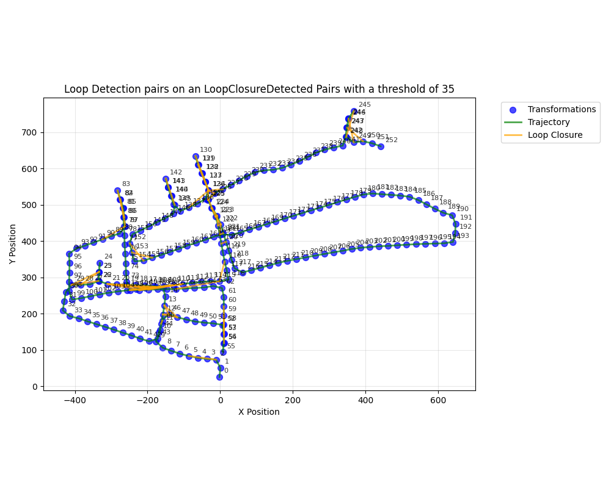

## TODO
- [x] kitti360 dataset loader works
- [x] pipeline running
- [x] density image generation
- [x] proper_framing

- [x] feature pruning
- [x] image matching
- [x] cloud 2 cloud ransac
- [ ] implement floor alignment rotation

# Overview
This is an implementation of efficient loop closure with Point Cloud Density maps. Builds off the authors work with kiss-icp for building egocentric lidar solutions Some parts are not included such as the finer alignment points such as using icp for more finer relative poses of edges.  This includes the flattening of lidar odometry maps using point to plane icp, creation of images into single channel depth maps. Then off the grayscale density image you extract orb keypoints and descriptors then match and compare against previous density images.  When a Match is found when you find about 25 good keypoints that past a lowes ratio to filter matches with .7 ratio we then use ransac to filter inliers and produce.  Why i chose to implement this is that it follows in line of the authors in providing egocentric lidar and slam features enabling a variety of sensor between normal spinning lidars and hemispherical lidars. As many previous works and other forms rely on sensor specific sensors that do not work with a variety of sensors. All Images are taken from the kitti360 dataset sequence zero unless otherwise specified. 

# Steps
1. align to flatten map to floor for more consistent density maps
2. generate density image remove floor points via thresholding
3. extract orb keypoints and descriptors
4. match v. previous ly generated images
5. reduce matches via hamming distance test (lowes)
6. perform ransac on best canidates to get SE2 image coordinate transform and remove outliers
7. if their are enough points over thrreshold (25 in our case) consider a match and generate a possible loop closure Canidate
8. (not implemented) generate a loop closure and perform pose graph optimization

step 8 is not currently implemented

# Visualizations
## Sequiential generated density maps
A comparison visualization of ransac point matching post lowes test. Below is a visualization of comparison of keypoint matching between two succesively generated density apart on the kitti360 sequence 00.  

The first image is a succesive denisty image generated 25 meters. After the lowes ratio test we have 63 matches and then after the performing ransac in the se2 space of the image we are able to remove 3 outliers and get a transformation of association that enables us to provide a prior of icp step that we use to provide a loop closure with an accurate relative pose in g2o

This second plot is another snapsshor shown 50m back in the path of travel and shows us considerably smaller amount of matches after the lowes test at 17. Then with one removal after the ransac step.

## Offline Loop Closure Detection

The next one is the visualization of a detected loop closure on the kitti360 we generate a denisty image every 25 meters moved and then we ignore matches generated from the previous 2 generated images not matched against. We acquire all matches over the threshold and draw them on the plot. We use a keypoint threshold of 35 for visual simplicity. A first we look at is the broad over view of all poses and what we see is we get 34 generated LoopClosure detections with a total of 51 matches.  The green lines represent the trajectory of the odometry and points represent the location of all density map images. The orange lines only represent loop closure detections between the density image points. No other information is represented by these lines

This next image is revisitation of an intersection that where we get our first loop closure detections andcanidates which is an intersection represented where error has not accumulated greatly. as only about 1600m into the run for the detection we don't see any great traslational deviations.

This second Image from kitti360 represented on a section get three passes one and what we can see is that we get greater traveling teh same paths but we aget fat greater disparities with  some loop closure canidates being generated with detections over 100m reported from from other points showing noticeable drift has occured graph.

